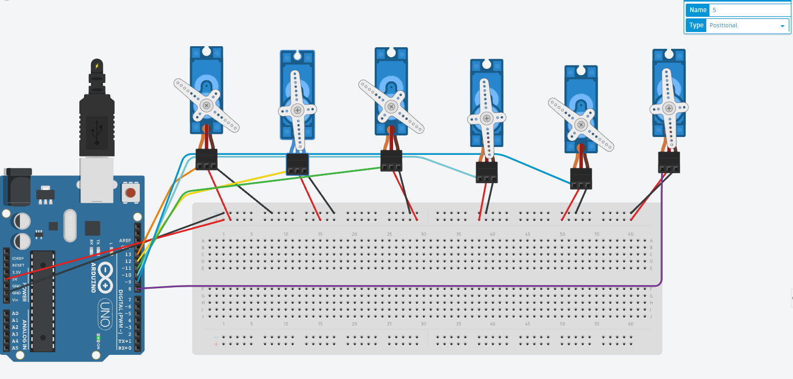

# first task  

* **OverView**  
    * Servo motor operation algorithm to mimic the robot's walking movement  

* **Steps**  
    * First We look at the robot's movement and see that it is repeated steps in which the feet exchange, we make one foot move before the other.  

    * Second There are 6 servo motors, 3 for each foot, for example, the right foot has a motor in the upper joint, the knee joint, and the foot joint.

    * Third Connecting the electronic parts:  
        * First we connect the power port and the ground from the Arduino to the board,  

        * Second we connect each servo to the signal port in the Arduino.
        
        * Third we connect all the power ports and the ground from the servo motors to the board.

        * Fourth Writing the code After downloading the Arduino, we call the servo library and then we know the motors and where we connected them, we write functions that repeat the movement of the feet continuously.

        * Connecting and programming an electronic circuit containing 6 servo motors  
        
        
