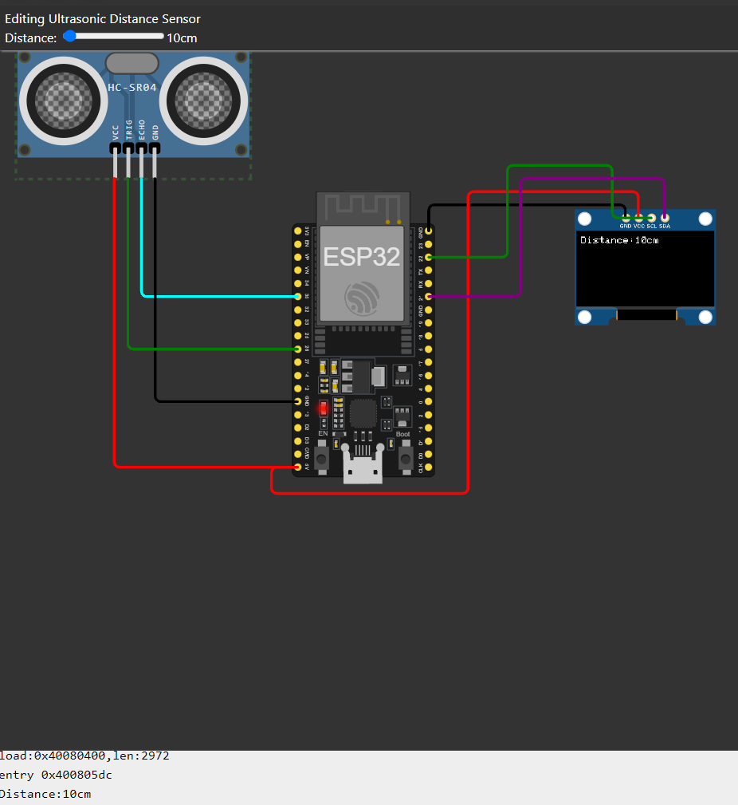
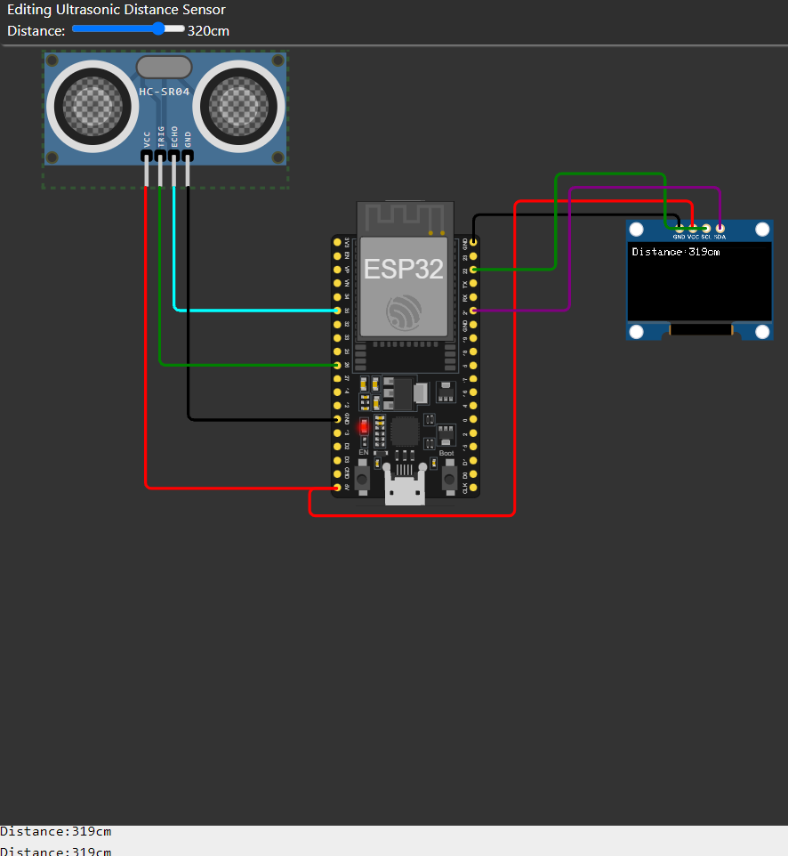

# task two

* **OverView**  
    * this task is how to implement ultrasoinc with esp32

* **Steps to implemention**
    * i used wokwi simulation to implement this experment  

    * i used Ultrasonic and connect it with ESP32 in pin 35, 26, GND and 5V 

    * and i add board-ssd1306 to display the distance.  

      
    i use silder to manage the distnace  
    another value 
    
